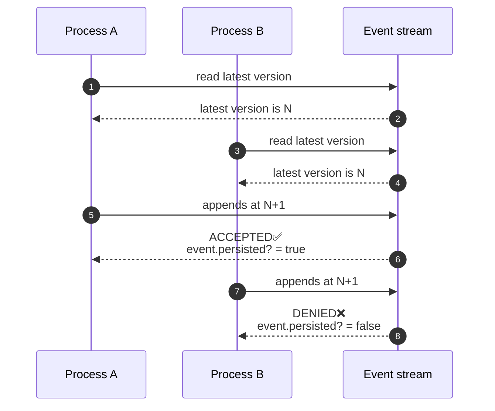

# Event Stream
{: .no_toc }

## Table of contents
{: .no_toc .text-delta }

1. TOC
{:toc}

---

An **Event Stream** is a sequenced group of events from the event log, identified by a stream ID. In practice, a stream usually represents a single entity instance — `Account:42`, `Order:99`. The stream is the primary interface for writing to the event log and interpretations orchestrating.

## Defining a stream

Streams are Ruby classes that inherit from `Funes::EventStream`. Name the class after the entity it tracks:

```ruby
# app/event_streams/debt_event_stream.rb
class DebtEventStream < Funes::EventStream; end
```

There is no schema to migrate, no table to create — every stream lives logically inside the shared `event_entries` table, scoped by the stream identifier you'll pass in next.

## Appending events

To record an event, call `.for(idx)` to get a stream instance for the expected entity, then `.append` the event:

```ruby
DebtEventStream.for("debts-123")
  .append(Debt::Issued.new(amount: 100, 
                           interest_rate: 0.05, 
                           at: Time.current))
```

The string passed to `.for` is the stream identifier (`idx`). It links all events for that entity together and ties them to their read models.

You don't need to create a stream before using it. If no events have been recorded for a given `idx`, the stream is implicitly created the moment the first event is appended. There is no setup step — `DebtEventStream.for("debts-456")` works whether `"debts-456"` has a hundred events or none at all.

## Validating events

Every append starts with `event.valid?` — the `ActiveModel` validations declared on the event class always run, so a malformed event is rejected before it reaches the log.

You can also opt into a **consistency validation**. An interpretation (see [Projections](/concepts/projection/)) replays the new event on top of the previously persisted ones and checks the logical invariants of the resulting state. If those invariants don't hold, the event is rejected — even if `valid?` would have passed.

{: .note }
With the stream configured, your responsibility ends at `.append`. Funes handles the rest — invoking `valid?`, replaying the interpretation, gathering errors, and deciding whether to persist.

### Defining a consistency validation

Wire it up with `consistency_projection`, passing the class that owns the invariant. In this example `VirtualOutstandingBalanceProjection` enforces the rule that the outstanding balance must never go negative — overdraws are not allowed:

```ruby
class DebtEventStream < Funes::EventStream
  consistency_projection VirtualOutstandingBalanceProjection
end

# This payment would overdraw the balance — the consistency check rejects it
invalid_event = Debt::PaymentReceived.new(principal_amount: 999_999, 
                                          interest_amount: 0, 
                                          at: Time.current)
DebtEventStream.for("debts-123").append(invalid_event)

invalid_event.persisted?    # => false
invalid_event.errors.any?   # => true
```

## Optimistic concurrency control

Each event on a stream carries a sequential `version` number. When you call `.append`, the stream reads its latest version (N) and assigns N+1 to the new event before persisting it.

If two processes append at the same time, both read N and both try to write at N+1. Only one of those writes can succeed — the second event is rejected and `event.persisted?` returns `false`. The losing process can re-read the stream and retry.



## Host-managed transactions

When you need to coordinate an `append` with other writes inside a transaction your code already controls, use `append!`. See the [Atomic writes](/recipes/atomic-writes/) recipe for the full pattern.
