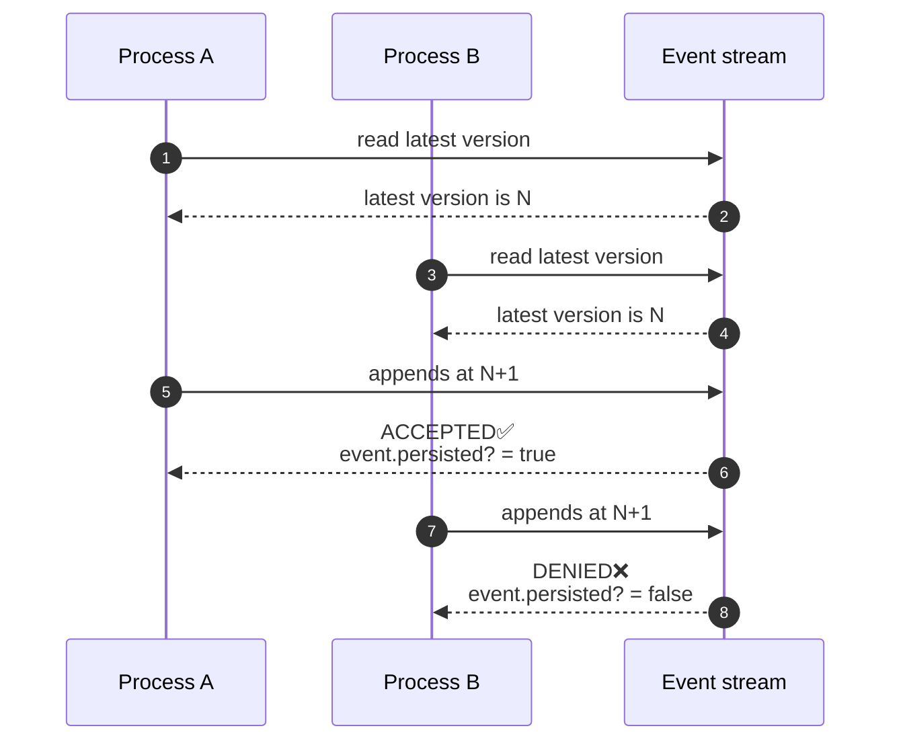

# Event Stream
{: .no_toc }

## Table of contents
{: .no_toc .text-delta }

1. TOC
{:toc}

---

An **Event Stream** is a sequenced group of events from the event log, under one stream ID. In practice, a stream usually represents a single entity instance — `Account:42`, `Order:99`. The stream is the primary interface to write to the event log and to orchestrate interpretations.

## Define a stream

Streams are Ruby classes that inherit from `Funes::EventStream`. Name the class after the entity it tracks:

```ruby
# app/event_streams/debt_event_stream.rb
class DebtEventStream < Funes::EventStream; end
```

There is no schema to migrate, no table to create — every stream lives logically inside the shared event log (the `event_entries` table), under the stream identifier you'll pass in next.

## Get a stream instance

Call `.for(idx)` on your stream class to get an instance scoped to a specific entity:

```ruby
stream = DebtEventStream.for("debts-123")
```

The string you pass to `.for` is the stream identifier (`idx`). It links all events for that entity together and ties them to their projections.

You don't need to create a stream before you use it. If a given `idx` has no events yet, Funes creates the stream implicitly when you append the first event. There is no setup step — `DebtEventStream.for("debts-456")` works whether `"debts-456"` has a hundred events or none at all.

## Append events

With the stream in hand, call `.append` to record an event:

```ruby
stream.append(Debt::Issued.new(amount: 100, 
                               interest_rate: 0.05, 
                               at: Time.current))
```

If you don't need to keep the stream reference around, you can chain the two calls:

```ruby
DebtEventStream.for("debts-123")
  .append(Debt::Issued.new(amount: 100, 
                           interest_rate: 0.05, 
                           at: Time.current))
```

### Host-managed transactions

When you need to coordinate an `append` with other writes inside a transaction your code already controls, use `append!`. See the [Atomic writes](/recipes/atomic-writes/) recipe for the full pattern.

## Validate events

Every append starts with `event.valid?` — the `ActiveModel` validations on the event class always run, so Funes rejects a malformed event before it reaches the log.

You can also opt into a **consistency validation**. An interpretation (see [Projections](/concepts/projection/)) replays the new event on top of the previously persisted ones and checks the logical invariants of the resulting state. If those invariants don't hold, Funes rejects the event — even if `valid?` would have passed.

{: .note }
For these validations, your responsibility ends at `.append` once you configure the stream. Funes handles the rest: it invokes `valid?`, replays the interpretation, gathers errors, and decides whether to persist. A [transactional projection](/concepts/projection/#persistence-tiers-for-projections) is the one exception — when it fails, `.append` raises, and the caller must rescue (see [Rescue transactional projection failures](/recipes/events-the-rails-way/controllers/#rescue-transactional-projection-failures)).

### Define a consistency validation

Wire it up with `consistency_projection` and pass the class that owns the invariant. In this example, `VirtualOutstandingBalanceProjection` enforces the rule that the outstanding balance must never go negative — it forbids overpayments:

```ruby
class DebtEventStream < Funes::EventStream
  consistency_projection VirtualOutstandingBalanceProjection
end

# The event itself is valid but payment exceeds what's owed —
# the resulting state breaks the invariant, so Funes denies the append
invalid_event = Debt::PaymentReceived.new(principal_amount: 999_999, 
                                          interest_amount: 0, 
                                          at: Time.current)
DebtEventStream.for("debts-123").append(invalid_event)

invalid_event.persisted?    # => false
invalid_event.errors.any?   # => true
```

## Optimistic concurrency control

Each event on a stream carries a sequential `version` number. When you call `.append`, the stream reads its latest version (N), assigns N+1 to the new event, and then persists it.

If two processes append at the same time, both read N and both try to write at N+1. Only one of those writes can succeed — Funes rejects the second event, and `event.persisted?` returns `false`. The losing process can then re-read the stream and retry.


```mermaid
sequenceDiagram
    autonumber
    participant A as Process A
    participant B as Process B
    participant Stream as Event stream

    A->>Stream: read latest version
    Stream-->>A: latest version is N
    B->>Stream: read latest version
    Stream-->>B: latest version is N
    A->>Stream: appends at N+1
    Stream-->>A: ACCEPTED✅<br/>event.persisted? = true
    B->>Stream: appends at N+1
    Stream-->>B: DENIED❌<br/>event.persisted? = false
```
---

Up next: [Projection](/concepts/projection/), the last of the three concepts — how an event stream becomes the state your application reads.