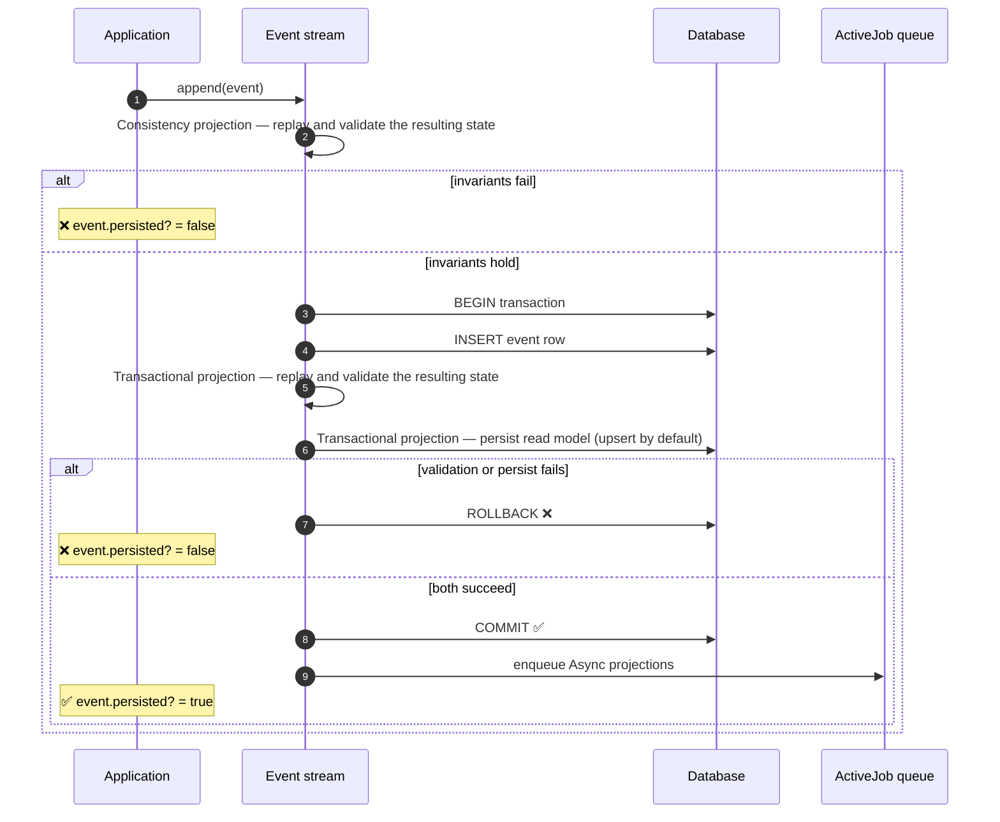

# Projection
{: .no_toc }

## Table of contents
{: .no_toc .text-delta }

1. TOC
{:toc}

---

A **Projection** transforms a stream of events into a state representation. In code, it's a Ruby class that inherits from `Funes::Projection`. 

Projections are the glue between the immutable log and what your application actually needs to answer — the derived state that your controllers, jobs and views reason over. Without them the event log is just inert facts; with them, those facts become the state the rest of your code relies on.

## The materialization model

Every projection must have a **materialization model** — the class that holds the state being built. It must be declared in the projection definition with `materialization_model`, and is one of two types:

- **Virtual** — usually an `ActiveModel`. Lives only in memory, recomputed on demand from the events. Nothing is written anywhere; the next query rebuilds it from scratch.
- **Persistent** — written somewhere durable so it can be queried directly without replaying. Two flavors:
  - **Database (default)** — usually an `ActiveRecord`. Funes upserts a row in a Funes-shaped table on every relevant event; scaffold the migration with `bin/rails generate funes:materialization_table`.
  - **Custom destination** — usually an `ActiveModel`. Supply your own persistence method to send the materialized state anywhere else (S3, Redis, a search index, an external API, etc.).

For more details about the setup of each one, see the [Setting up projections](/recipes/materialization-models/) recipes.

## The interpretations DSL

The interpretations DSL is the heart of every projection — and the surface Funes was designed around. It gives you three building blocks that together describe how a stream of events becomes a final state:

- `initial_state` (optional) runs once before any events are processed, returning the starting state. If you don't define it, Funes calls `materialization_model.new` and uses the empty instance.
- `interpretation_for` describes how a single event type affects state — one block per event type — and runs once per matching event.
- `final_state` (optional) runs once after all events are processed, returning the finalised state. If you don't define it, the state accumulated by the interpretations is returned as-is.

Funes calls them in that order: `initial_state`, then each event through its matching `interpretation_for` in stream order, then `final_state` on the accumulated result.

```ruby
# app/projections/outstanding_balance_projection.rb
class OutstandingBalanceProjection < Funes::Projection
  materialization_model OutstandingBalance

  initial_state do |materialization_model_klass, at|
    materialization_model_klass.new(observed_at: at)
  end

  interpretation_for Debt::Issued do |state, event, at|
    state.outstanding_balance = event.amount
    state.issuance_date = at
    state.last_payment_at = nil
    state
  end

  interpretation_for Debt::PaymentReceived do |state, event, at|
    state.outstanding_balance -= event.principal_amount
    state.last_payment_at = at
    state
  end

  final_state do |state, at|
    state.assign_attributes(days_in_effect: (at.to_date - state.issuance_date.to_date).to_i)
    state
  end
end
```

{: .important }
The `at` parameter inside `interpretation_for` is each event's own occurrence date/time — when the fact happened. The `at` inside `initial_state` and `final_state` is the **query's temporal reference** — the point in time the projection is being computed for, i.e., the moment you're asking about.

Every block returns the (possibly mutated) state object. The DSL is functional — state in, state out, no hidden mutation — which keeps projections predictable and [trivial to test](/recipes/testing-projections/).

The per-event handler is where event-sourced systems usually accumulate (or shed) complexity, so Funes makes those few lines pull a lot of weight: each interpretation stays small, while the framework handles replay, ordering, persistence, and concurrency around them. Most of your domain logic lives here.

### Strict mode

By default, a projection silently ignores events it has no `interpretation_for`. If you want Funes to raise an error instead — useful for critical projections where a missing handler can be an issue — enable strict mode:

```ruby
class OutstandingBalanceProjection < Funes::Projection
  strict_mode!
  # ...
end
```

## Persistence tiers for projections

Funes orchestrates projection materializations across three tiers, from synchronous and blocking (to ensure strong consistency when it is necessary) to fully asynchronous. Each tier serves a specific use case:

| Tier | When it runs | Use case                                                                                                                                                                                                                                                                      |
|:-----|:-------------|:------------------------------------------------------------------------------------------------------------------------------------------------------------------------------------------------------------------------------------------------------------------------------|
| Consistency | Before the event is persisted | Validate the resulting state with a virtual projection — if invariants fail, the event is rejected and never persisted (see: [Setting up virtual projections](/recipes/materialization-models/virtual/))                                                           |
| Transactional | Same DB transaction as the event insertion | Keep a persistent read model (usually a default persistent projection) strongly consistent with the log — a failure rolls back both the projection and the event insertion (see: [Setting up persistent projections](/recipes/materialization-models/persistent/)) |
| Async | Background job via `ActiveJob` | Update persistent projections for reports, analytics, or eventually consistent views (see: [Setting up persistent projections](/recipes/materialization-models/persistent/))                                                                                    |

{: .note }
All three tiers are opt-in — register a projection at a tier only when you need its specific guarantee. Of the three, the consistency tier is the one **highly recommended**: it's the best place to reject an event before it enters the log, so reach for it whenever the resulting state has business invariants worth enforcing.

Because async projections run on `ActiveJob`, any standard Rails job backend works out of the box — `Sidekiq`, `Solid Queue`, or any other `ActiveJob`-compatible adapter — with no Funes-specific wiring. Standard `ActiveJob` scheduling options like `queue`, `wait`, and `wait_until` are accepted when you register an async projection.

The sequence below traces a single `append` through all three tiers, including the rejection branches when the consistency or transactional steps fail:



---

🎉 **Congratulations** — you've now met all three concepts Funes is built around: **events** as immutable facts, **event streams** as how they're grouped and recorded, and **projections** as how those facts become the state your application reads. From here, the [Recipes](/recipes/) section is where you put them to work.