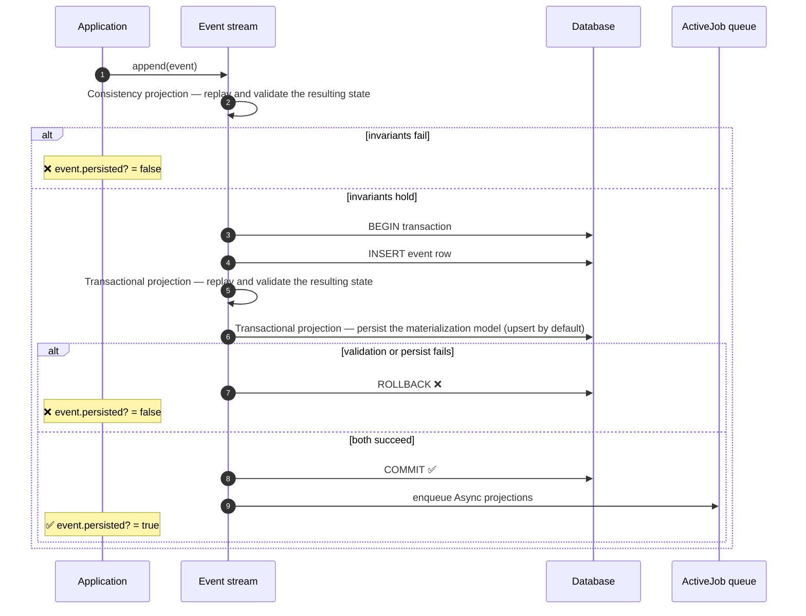

# Projection
{: .no_toc }

## Table of contents
{: .no_toc .text-delta }

1. TOC
{:toc}

---

A **Projection** transforms an event stream into a state representation. In code, it's a Ruby class that inherits from `Funes::Projection`.

Projections are the glue between the immutable log and what your application actually needs to answer — the derived state that your controllers, jobs, and views reason over. Without them the event log is just inert facts; with them, those facts become the state the rest of your code relies on.

## The materialization model

Every projection must have a **materialization model** — the class that holds the state that the projection builds. Declare it in the projection definition with `materialization_model`. It is one of two types:

- **Virtual** — usually an `ActiveModel`. It lives only in memory. Funes recomputes it on demand from the events. The state you get back is ephemeral.
- **Persistent** — Funes writes it somewhere durable, so you can query it directly without a replay. Two flavors:
  - **Database (default)** — usually an `ActiveRecord`. Funes upserts a row in a Funes-shaped table on every relevant event; scaffold the migration with `bin/rails generate funes:materialization_table`.
  - **Custom destination** — usually an `ActiveModel`. Supply your own persistence method to send the materialized state anywhere else (S3, Redis, a search index, an external API, etc.).

For more details about the setup of each one, see the [Set up projections](/recipes/materialization-models/) recipes.

A materialization model can reference regular Rails models too. Include `Funes::Associations` and declare `refers_to` exactly as you would [on an event](/concepts/event/#referencing-other-models) — the reference then reads and writes the same way on both sides of an interpretation block:

```ruby
# app/models/outstanding_balance.rb
class OutstandingBalance
  include ActiveModel::Model
  include ActiveModel::Attributes
  include Funes::Associations

  refers_to :customer

  attribute :outstanding_balance, :decimal
end
```

```ruby
interpretation_for Debt::Issued do |state, event, _at|
  state.customer = event.customer
  state
end
```

Only the id lives in the model's attributes, so the reference survives every rebuild.

{: .warning }
On an **ActiveRecord-backed** materialization model, declare a regular `belongs_to` instead — that's the idiomatic tool there, and it brings preloading and `inverse_of` with it. See [Reference Active Record models](/recipes/referencing-active-record-models/#a-note-on-activerecord-materialization-models).

## The interpretations DSL

The interpretations DSL is the heart of every projection — and the surface at the center of the Funes design. It gives you three building blocks that together describe how an event stream becomes a final state:

- `initial_state` (optional) runs once before Funes processes any events, and returns the starting state. If you don't define it, Funes calls `materialization_model.new` and uses the empty instance.
- `interpretation_for` describes how a single event type affects state — one block per event type — and runs once per matching event.
- `final_state` (optional) runs once after Funes processes all events, and returns the final state. If you don't define it, Funes returns the state from the interpretations as-is.

Funes calls them in that order: `initial_state`, then each event through its matching `interpretation_for` in stream order, then `final_state` on the accumulated result.

```ruby
# app/projections/outstanding_balance_projection.rb
class OutstandingBalanceProjection < Funes::Projection
  materialization_model OutstandingBalance

  initial_state do |materialization_model_klass, at|
    materialization_model_klass.new(observed_at: at)
  end

  interpretation_for Debt::Issued do |state, event, at|
    state.outstanding_balance = event.amount
    state.issuance_date = at
    state.last_payment_at = nil
    state
  end

  interpretation_for Debt::PaymentReceived do |state, event, at|
    state.outstanding_balance -= event.principal_amount
    state.last_payment_at = at
    state
  end

  final_state do |state, at|
    state.assign_attributes(days_in_effect: (at.to_date - state.issuance_date.to_date).to_i)
    state
  end
end
```

{: .important }
The `at` parameter inside `interpretation_for` is each event's own occurrence date/time — when the fact happened. The `at` inside `initial_state` and `final_state` is the **query's temporal reference** — the point in time that you ask about.

Every block returns the (possibly mutated) state object. The DSL is _functional flavored_ — state in, state out, no hidden mutation. That style keeps projections predictable and [trivial to test](/recipes/testing-projections/).

The per-event handler is where event-sourced systems usually accumulate (or shed) complexity, so Funes makes those few lines pull a lot of weight. Each interpretation stays small, and the framework handles replay, ordering, persistence, and concurrency around it. Most of your domain logic lives here.

### Strict mode

By default, a projection silently ignores events that have no `interpretation_for`. If you want Funes to raise an error instead — useful for critical projections where a missing handler can be an issue — enable strict mode:

```ruby
class OutstandingBalanceProjection < Funes::Projection
  strict_mode!
  # ...
end
```

## Persistence tiers for projections

Funes orchestrates projection materializations across three tiers, from synchronous and blocking (for strong consistency when you need it) to fully asynchronous. Each tier serves a specific use case:

| Tier | When it runs | Use case                                                                                                                                                                                                                                                                      |
|:-----|:-------------|:------------------------------------------------------------------------------------------------------------------------------------------------------------------------------------------------------------------------------------------------------------------------------|
| Consistency | Before Funes persists the event | Validate the resulting state with a virtual projection — if invariants fail, Funes rejects the event and never persists it (see [Set up virtual projections](/recipes/materialization-models/virtual/))                                                           |
| Transactional | In the same database transaction as the event insertion | Keep a persistent projection strongly consistent with the log — a failure rolls back both the projection and the event insertion (see [Set up persistent projections](/recipes/materialization-models/persistent/)) |
| Async | Background job via `ActiveJob` | Update persistent projections for reports, analytics, and other eventually consistent needs (see [Set up persistent projections](/recipes/materialization-models/persistent/))                                                                                    |

{: .note }
All three tiers are opt-in: a projection runs at a tier only when you register it there. The consistency tier is the **highly recommended** one — it's the best place to reject an event before the event enters the log, whenever the resulting state has business invariants to enforce.

Because async projections run on `ActiveJob`, any standard Rails job backend works out of the box — `Sidekiq`, `Solid Queue`, or any other `ActiveJob`-compatible adapter — with no Funes-specific wiring. When you register an async projection, you can pass standard `ActiveJob` scheduling options like `queue`, `wait`, and `wait_until`.

The sequence below traces a single `append` through all three tiers, including the rejection branches when the consistency or transactional steps fail:


```mermaid
sequenceDiagram
    autonumber
    participant App as Application
    participant Stream as Event stream
    participant DB as Database
    participant Job as ActiveJob queue

    App->>Stream: append(event)
    Stream->>Stream: Consistency projection — replay and validate the resulting state
    alt invariants fail
        Note over App: ❌ event.persisted? = false
    else invariants hold
        Stream->>DB: BEGIN transaction
        Stream->>DB: INSERT event row
        Stream->>Stream: Transactional projection — replay and validate the resulting state
        Stream->>DB: Transactional projection — persist the materialization model (upsert by default)
        alt validation or persist fails
            Stream->>DB: ROLLBACK ❌
            Note over App: ❌ event.persisted? = false
        else both succeed
            Stream->>DB: COMMIT ✅
            Stream->>Job: enqueue Async projections
            Note over App: ✅ event.persisted? = true
        end
    end
```

---

🎉 **Congratulations** — you've now met the three core concepts of Funes. **Events** are immutable facts. **Event streams** group and record them. **Projections** turn those facts into the state your application reads. From here, the [Recipes](/recipes/) section is where you put them to work.